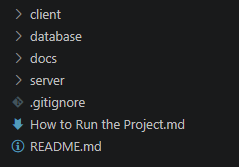
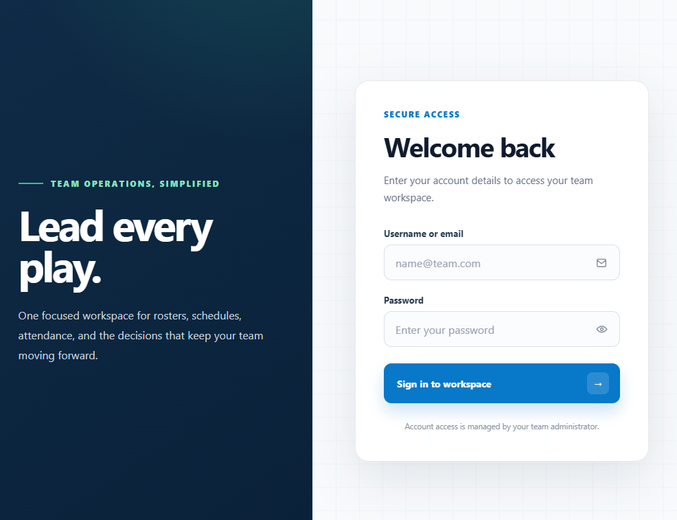
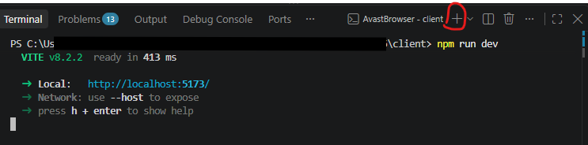
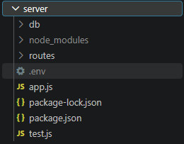
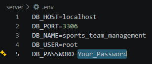
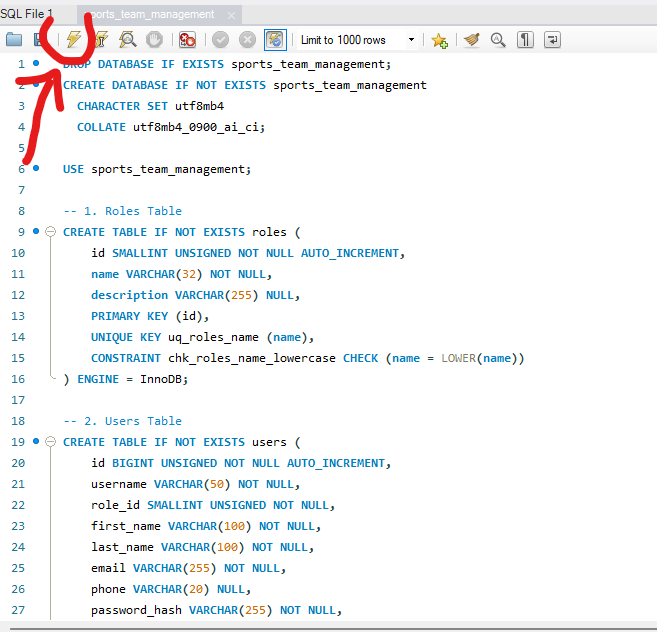
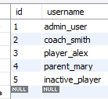
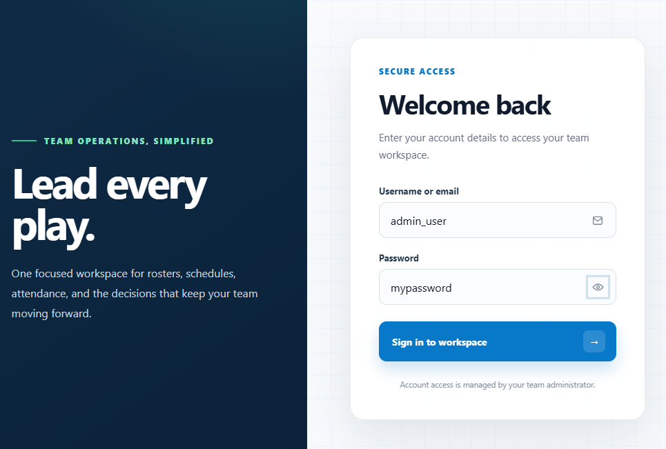

# Sports Team Management — How to Run the Project

This guide will walk you through every step required to set up and run the Sports Team Management project locally, including the frontend, backend, and database.

### 1. Clone the Project

First, clone the project from GitHub to your computer.

Once the project has been cloned, open the project folder in Visual Studio Code.

### 2. Open the Project in Visual Studio Code

Open the cloned project in Visual Studio Code.

Your project structure should look similar to this:

## Running the Frontend

### 3. Open the Terminal

In Visual Studio Code, open the integrated terminal.

You can use the keyboard shortcut:

`Ctrl + J`

You should see the terminal appear at the bottom of Visual Studio Code.

### 4. Navigate to the Frontend Directory

In the terminal, navigate to the client directory:

`cd client`

### 5. Install the Node Dependencies

Install all the dependencies required by the frontend:

`npm install`

Note: You only need to run npm install when the dependencies have not already been installed (for example, the first time you set up the project).

### 6. Start the Frontend

Start the local React development server:

`npm run dev`

Once the server starts, open the following URL in your browser:

`http://localhost:5173/`

You should now see the Sports Team Management application.

Frontend is now running! 🎉

## Running the Backend

Now that the frontend is running, it's time to start the backend.

### 7. Open a Second Terminal

Since the first terminal is already being used to run the frontend, open a second terminal in Visual Studio Code.

Click the + icon in the terminal panel.

Important: Do not close the first terminal. The frontend needs to keep running while the backend is running in the second terminal.

### 8. Navigate to the Backend Directory

In the new terminal, navigate to the server directory:

`cd server`

### 9. Install the Backend Dependencies

Install the backend dependencies:

`npm install`

Note: This is only required the first time you set up the project, or whenever the project's dependencies change.

### 10. Start the Backend Server

Start the backend server using:

`nodemon`

Once the server starts successfully, open the following URL in your browser:

`http://localhost:3001/`

If the backend is running correctly, you should see a response from the server:

`"Welcome to our platform !"`

Backend is now running successfully! 🎉

### Congratulations! You now have both the frontend and backend running.

## Setting Up the Database

Before the project can work correctly, you need to make sure your MySQL database is configured properly.

### 11. Configure Your MySQL Password

Important: Only follow this step if you created a password for your MySQL server when you installed MySQL.

If you did not create a MySQL password, you can skip this step and continue to Step 12: Run the Database.

If you created a MySQL password, you need to add it to the project's .env file. Otherwise, the backend will not be able to connect to your MySQL server.

### Open the .env File

In Visual Studio Code, open:

`server/.env`

Find the following line:

`DB_PASSWORD=`

Enter your MySQL password after the = sign.

For example:

It should look something like:

`DB_PASSWORD=Your_Password`

### ⚠️ Important

### Do not change anything else in the .env file.

### Also, do not add spaces around your password.

Correct:

`DB_PASSWORD=Your_Password`

Incorrect:

`DB_PASSWORD= Your_Password`

## Running the Database

### 12. Open MySQL Workbench

Open MySQL Workbench on your computer.

### 13. Open the Database SQL File

In MySQL Workbench, open the following file from the project:

To open a file
`CTRL + SHIFT + O`

File:
`database/sports_team_management.sql`

### 14. Run the SQL File

Execute the SQL script in MySQL Workbench.

The script will create and populate the database required by the Sports Team Management application.

Once the script finishes successfully, your database is ready! 🎉

## Login Credentials

You can now log into the application using the usernames provided below.

The default password for all users is:

#### <b>mypassword<b>

[IMAGE — Add screenshot showing the available usernames/credentials]

<b>Note: Make sure you use one of the provided usernames when logging into the application.</b>

<b>🎉 You're Done!</b>

#### Congratulations! You have successfully set up the Sports Team Management project.

At this point, you should have:

✅ The React frontend running on http://localhost:5173/
✅ The backend server running on http://localhost:3001/
✅ The MySQL database created and populated
✅ The application ready to use

Open your browser and go to:

`http://localhost:5173/`

Your application should look similar to this:

🎊 You're all set!

Enjoy the Sports Team Management project!
